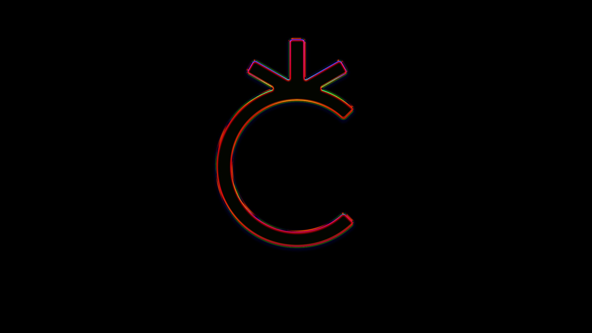

# Basic tutorial that explains how a user/developer can install and use the ArtCoin Technology



### Table of Content:
1. [Library Description](#library-description)
2. [Project Description](#project-description)
3. [Library installation and setup guide](#installation)

<a id="library-description"></a>
## Library Description
This document represents the instruction on how to use install and use the ArtCoin Technology

<a id="project-description"></a>
## Project Description
ArtCoin - a Sharing Economy tool that facilitates the exchange of assets within the Creative Community and the usage of underutilized assets.
ArtCoin is a bridge for Institutions and their communities to a sharing economy.
ArtCoin.
We are building:
1. <b>ArtCoin currency:</b> an exchange coin for the underutilized assets
2. <b>ArtCoin technology:</b> a technology that allows individuals and entities to exchange their underutilized assets (similar to PayPal smart buttons)

<a id="installation"></a>
## Library installation and setup guide

### Project setup
```
npm install
```

### Compiles and hot-reloads for development
```
npm run serve
```

### Compiles and minifies for production
```
npm run build
```

### Lints and fixes files
```
npm run lint
```

### Tests Unit
```
npm run test:unit
```

### Customize configuration
See [Configuration Reference](https://cli.vuejs.org/config/).
